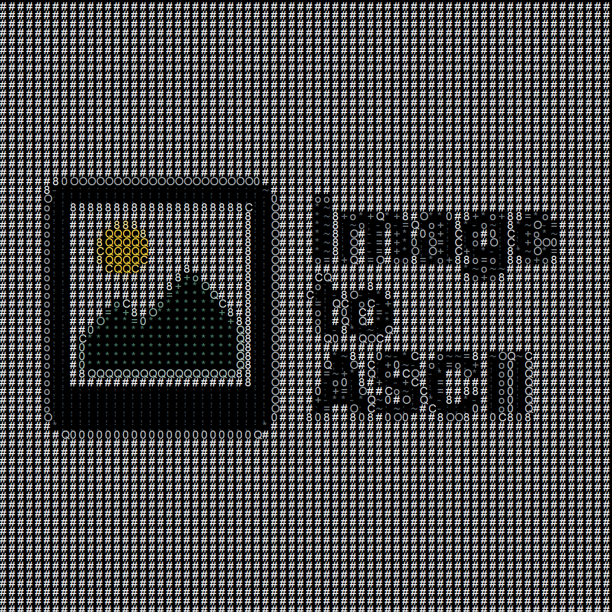
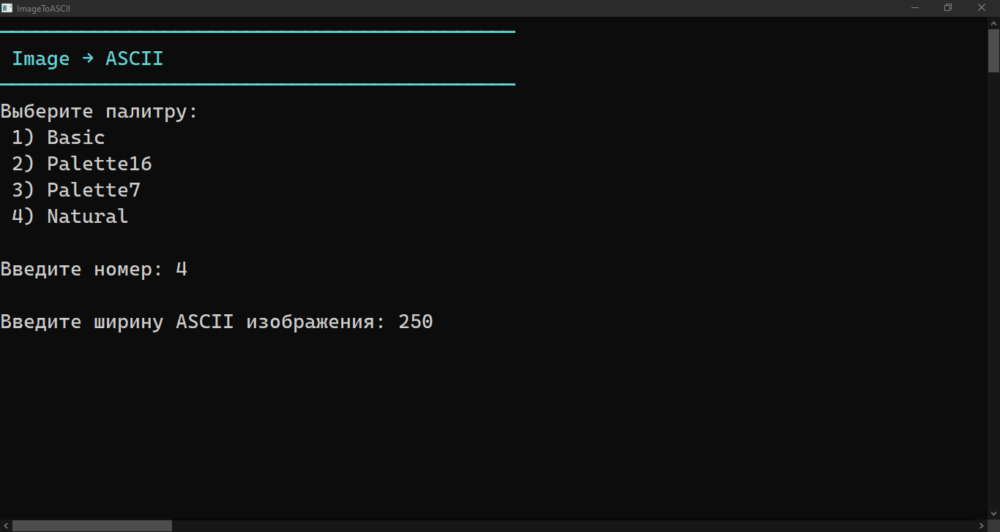
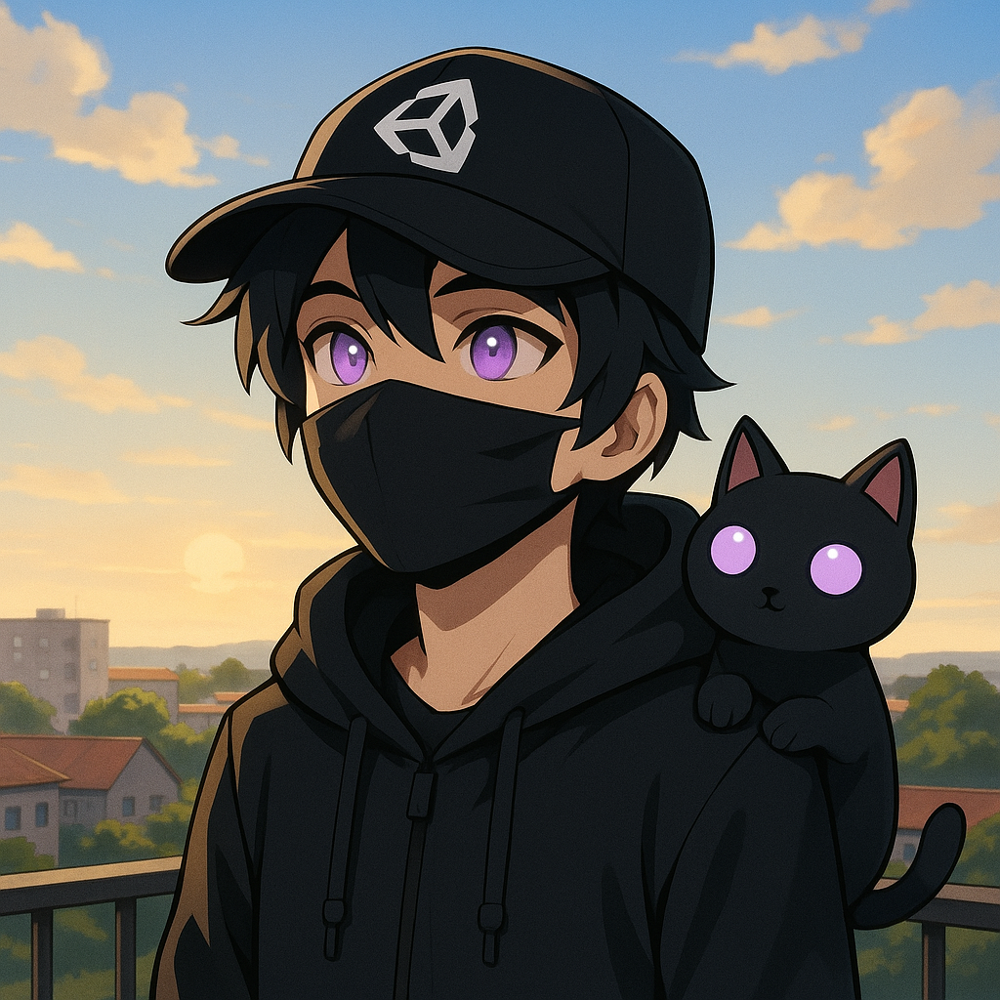
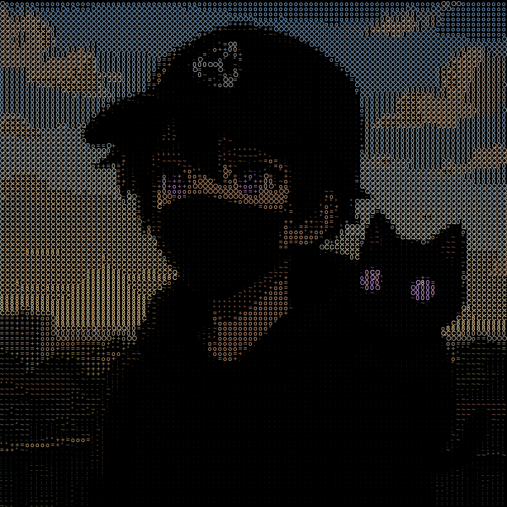
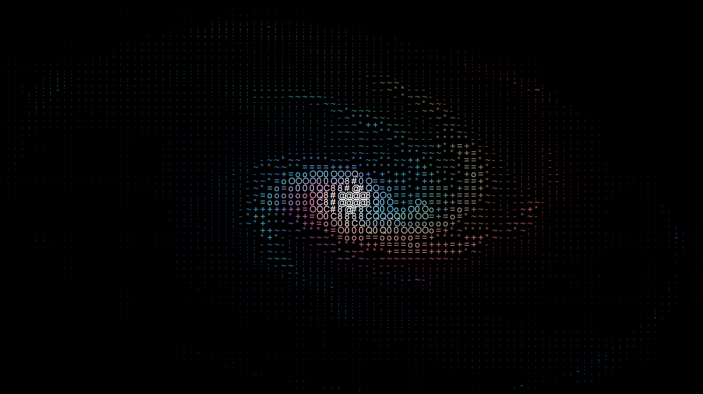
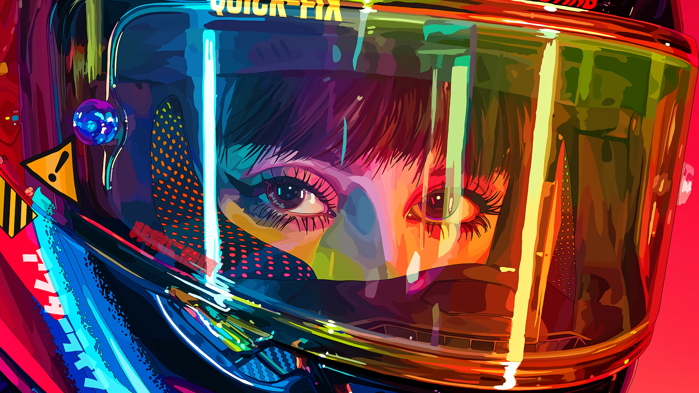
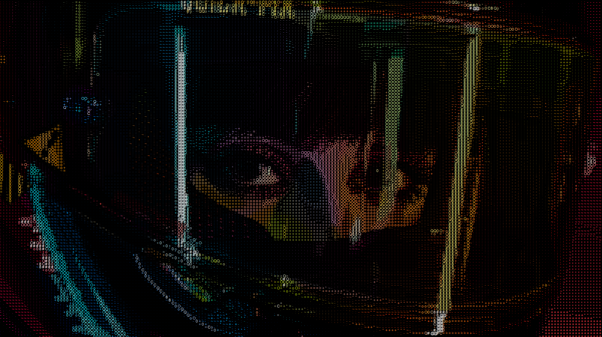
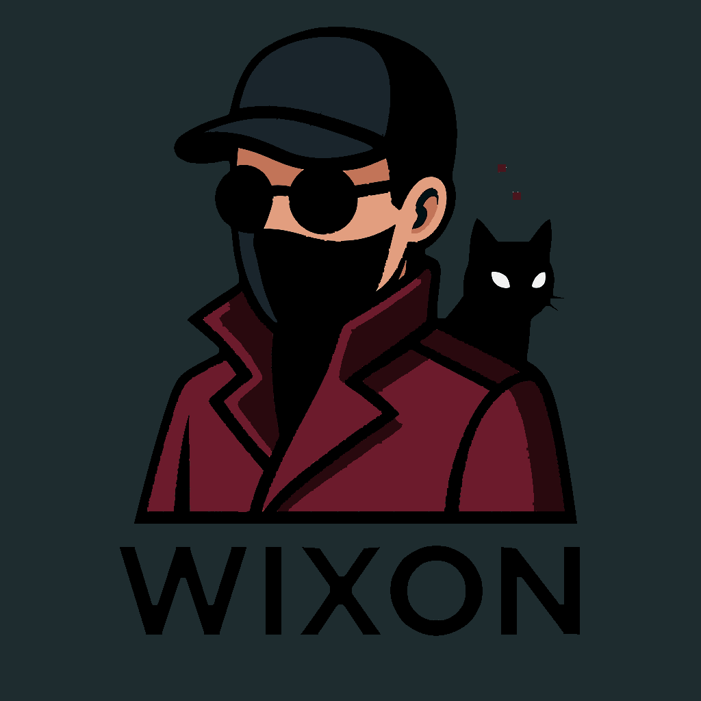

# 🖼️ ImageToASCII

*Конвертируй свои фото в ASCII-шедевры… или в груду символов, которая никому не нужна.*

---

## 💀 Обзор

**ImageToASCII** — консольный инструмент, который превращает любое изображение в ASCII-арт и сохраняет его как PNG.  
Да, прямо так, просто потому что можно.  

---

## 🧠 Основные возможности

- Конвертация изображений в ASCII с выбором палитры (Basic, Palette16, Palette7, Natural)  
- Настройка ширины ASCII-вывода  
- Сохранение результата как PNG  
- Полная цветовая карта для «правдивого» ASCII-арта 
---

## 📸 Скриншоты

  
  
Консольное меню: выбери палитру, укажи ширину и начинай магию ASCII.

  
  
  
Слева — исходное изображение. Справа — ASCII-шедевр.

  
  
  
Слева — исходное изображение. Справа — ASCII-шедевр.

  
  
  
Слева — исходное изображение. Справа — ASCII-шедевр.

---

## 👨‍💻 Автор

Создан **Wixon Shade** —  
тем самым человеком, который уверен, что консольное окно — это всё, что нужно для искусства.  

---

## ☕ Поддержка

Хочешь больше странных экспериментов, превращающихся в полезные инструменты?  
Можно поддержать тут → [💰 Donation Alerts](https://dalink.to/w1xon)

Следи за обновлениями и гайдами:  
- [Telegram](https://t.me/CoderW0rker)  
- [YouTube](https://www.youtube.com/@w_ixon)

> Каждая кружка кофе увеличивает шанс, что изображение переживёт ASCII-конвертацию.

---

  © 2025 Wixon Shade — Сделано с 🖤, C# и сомнительными жизненными решениями. 
  

