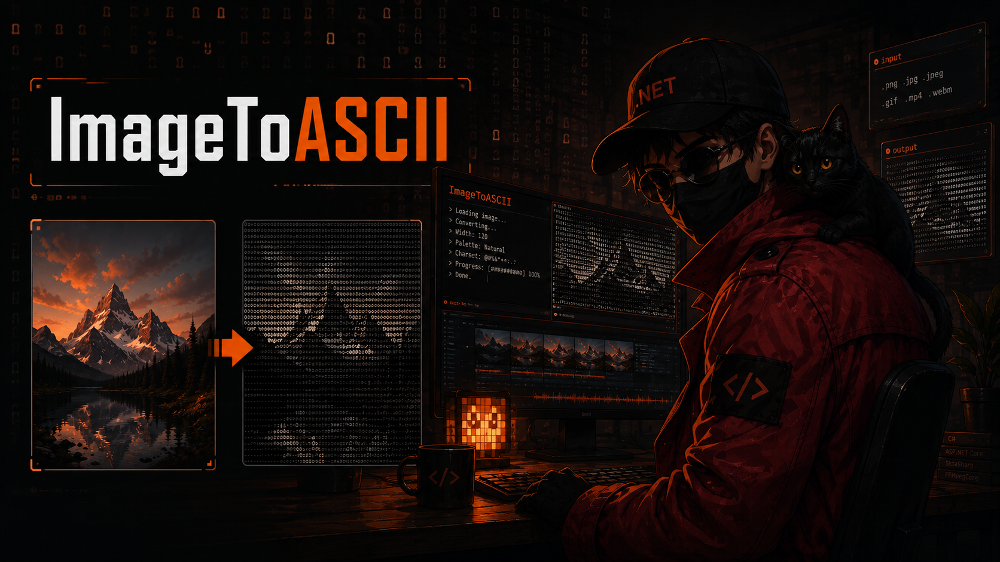
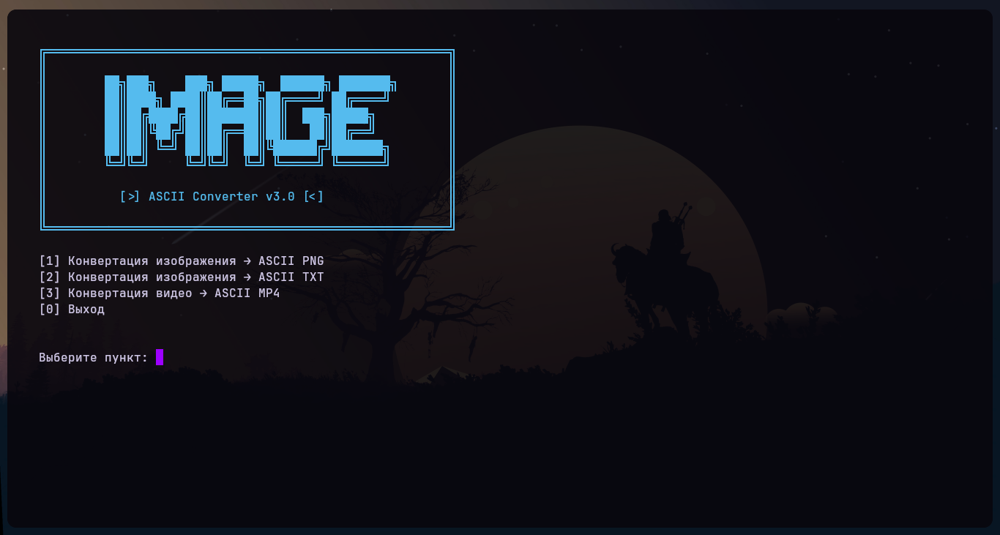
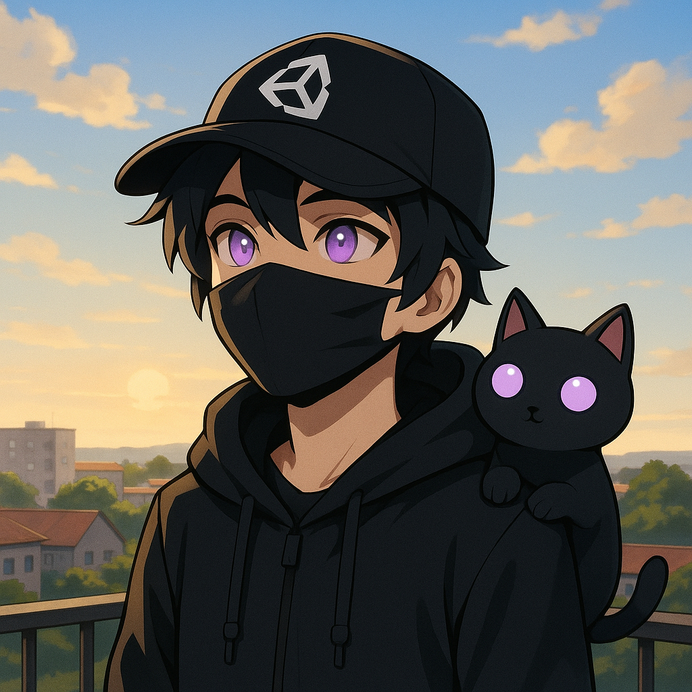
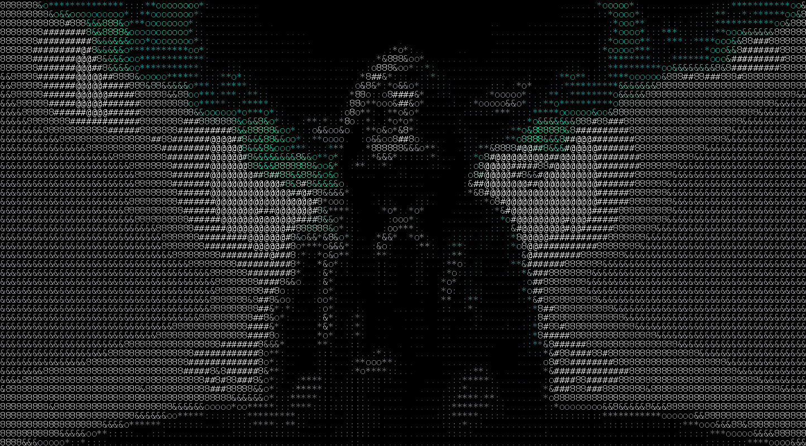
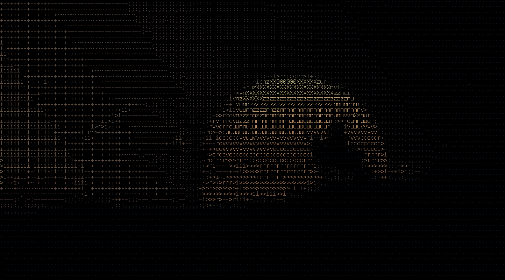
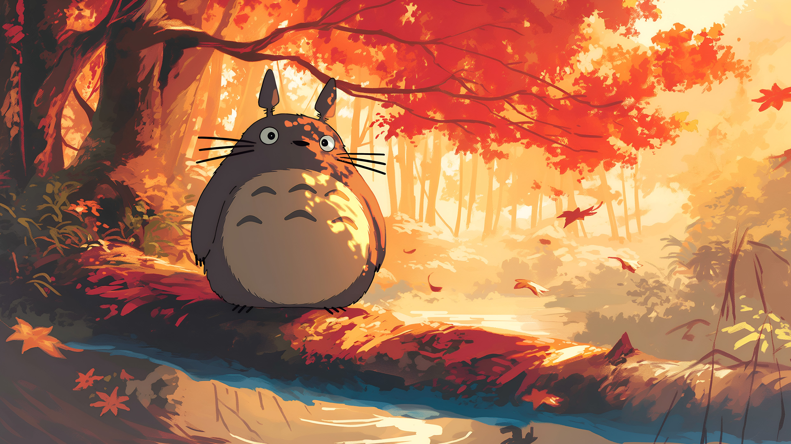
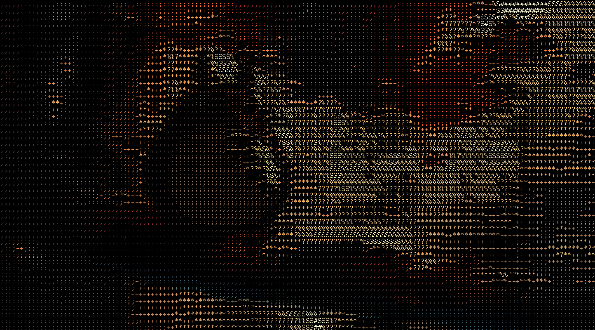
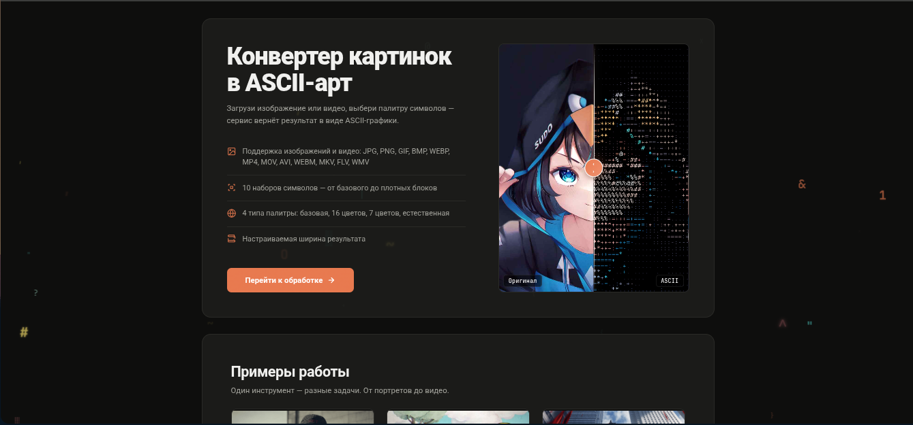
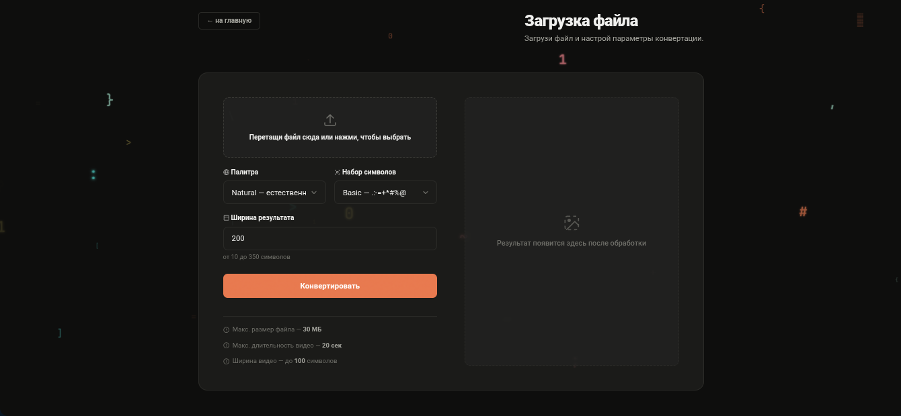

# 🖼️ ImageToASCII

*Конвертер картинок и видео в ASCII-арт. Консоль или браузер — на выбор.*

---

## 💀 Обзор

**ImageToASCII** превращает изображения и видео в ASCII-арт.

С версии 3.0 проект состоит из трёх частей:

- **CLI** — консольная утилита, без лимитов, работает локально
- **Web** — сервис на ASP.NET Core, можно попробовать прямо в браузере
- **Core** — общая библиотека конвертации, которую используют и CLI, и Web

---

## 🧠 Что умеет

- 🖼️ Картинки → ASCII (PNG)
- 🎞️ Видео → ASCII-видео, со звуком
- 🌐 Веб-версия — загрузка файла, очередь на обработку, скачивание результата
- 💻 CLI — та же логика, без лимитов веб-версии
- 🎨 4 цветовые палитры (Basic, Palette16, Palette7, Natural), 10 наборов символов
- 🐧 Linux и Windows

---

## ⚡ v3.0 — что изменилось

Крупное обновление проекта.

- Логика конвертации вынесена в отдельную библиотеку `ImageToASCII.Core`.
- Появилась веб-версия: drag&drop загрузка, статус обработки в реальном времени, очередь заданий.
- Проверка файлов по сигнатуре, а не по расширению.
- Ускорение конвертации видео

---

## 🌐 Сайт vs 💻 CLI

Сайт — для быстрой проверки без установки.

CLI — без лимитов, работает локально, полный контроль над настройками.

🌐 Попробовать: чутка позже
💻 Скачать: [релизы на GitHub](https://github.com/W1xon/ImageToASCII/releases)

---

## 🗺️ Версии

- **v3.0** — Core вынесен отдельно, добавлена веб-версия, движок ускорен
- **v2.1** — склейка звука с видео, поддержка Linux
- **v2.0** — конвертация видео в ASCII
- **v1.0** — конвертация изображений, консоль

---

## 📸 Скриншоты

### 🧩 Консоль

  

### 🖼️ Изображения → ASCII

  
  
  

  
  
  

### 🌐 Веб-версия

  
  

---

## 🎞️ Видео → ASCII

<video src="https://github.com/W1xon/ImageToASCII/blob/main/Assets/Video_ASCII.webm" width="50%" controls></video>

Каждый кадр обработан, звук склеен с оригиналом — теперь еще быстрее.

---

## 👨‍💻 Автор

Создан **Wixon Shade** — человеком, который посмотрел на видео и сказал: «А что если… в ASCII для всех?». Потом переписал всё с нуля.

---

## ☕ Поддержка

Хочешь больше странных экспериментов, которые внезапно становятся рабочими инструментами?

→ [💰 Donation Alerts](https://dalink.to/w1xon)

Где я живу и иногда объясняю, **зачем всё это**:

- 📢 Telegram — https://t.me/CoderW0rker
- 🎥 YouTube — https://www.youtube.com/@w_ixon

> Каждая кружка кофе повышает шанс, что следующая версия будет ещё опаснее.

---

  © 2026 Wixon Shade — Сделано с 🖤, C#, и чрезмерным вниманием к ASCII. 
  

